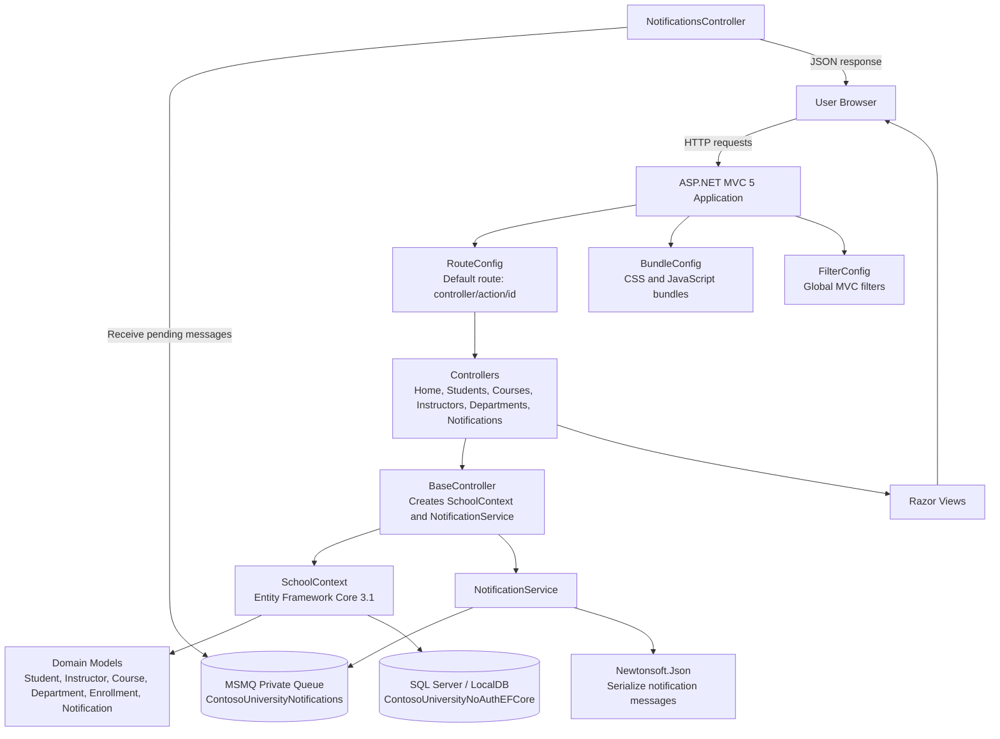

# Contoso University Application Overview

## Summary

`ContosoUniversity` is an ASP.NET MVC 5 web application targeting `.NET Framework 4.8`. It models a university administration system with CRUD pages for students, courses, instructors, and departments.

The app uses Entity Framework Core 3.1 with SQL Server through `SchoolContext`. The default connection string in `Web.config` points to LocalDB database `ContosoUniversityNoAuthEFCore`.

## Main Capabilities

- Manage students, including enrollment data.
- Manage courses and course assignments.
- Manage instructors, office assignments, and instructor-course relationships.
- Manage departments.
- Display enrollment statistics on the About page.
- Send basic entity-change notifications through Microsoft Message Queuing (MSMQ).
- Expose a notifications dashboard and JSON endpoints for retrieving pending notifications.

## Technology Stack

- `.NET Framework 4.8`
- ASP.NET MVC 5
- Razor views
- Entity Framework Core 3.1
- SQL Server / LocalDB
- Microsoft Message Queuing through `System.Messaging`
- Newtonsoft.Json for notification serialization
- Bootstrap and jQuery for client-side UI assets

## Runtime Flow

1. `Global.asax.cs` starts the MVC application.
2. MVC areas, filters, routes, and bundles are registered.
3. `InitializeDatabase` creates a `SchoolContext` using the `DefaultConnection` connection string.
4. `DbInitializer.Initialize` seeds or initializes the database.
5. Requests are routed through `RouteConfig` using the default `{controller}/{action}/{id}` pattern.
6. Controllers inherit from `BaseController`, which creates a `SchoolContext` and `NotificationService`.
7. CRUD operations use EF Core entities and may send notifications to MSMQ.
8. `NotificationsController` reads pending queue messages and returns them to the UI as JSON.

## Architecture Diagram

## Key Files

- `Web.config`: application settings, database connection string, target framework, and assembly binding redirects.
- `Global.asax.cs`: application startup and database initialization.
- `App_Start/RouteConfig.cs`: MVC routing configuration.
- `Data/SchoolContext.cs`: EF Core database context and entity mapping.
- `Data/DbInitializer.cs`: database seeding and initialization logic.
- `Controllers/BaseController.cs`: shared controller setup for database and notifications.
- `Services/NotificationService.cs`: MSMQ queue creation, send, receive, and notification serialization.
- `Controllers/NotificationsController.cs`: notification dashboard and JSON endpoints.
- `Models/*`: domain entities for the university system.
- `Views/*`: Razor UI pages for MVC actions.

## Configuration Notes

- `DefaultConnection` currently uses LocalDB with integrated security.
- `NotificationQueuePath` defaults to `.` local private MSMQ queue `ContosoUniversityNotifications`.
- The app has anonymous IIS Express authentication enabled and Windows authentication disabled in the project file.
- Notifications are best-effort: queue errors are written to debug output and do not block the main CRUD operation.

## Modernization Considerations

- LocalDB / SQL Server can be migrated to Azure SQL Database or Azure SQL Managed Instance.
- MSMQ can be migrated to Azure Service Bus for cloud-native messaging.
- Plain connection strings in `Web.config` can be moved to Azure Key Vault or platform configuration.
- ASP.NET MVC 5 on `.NET Framework 4.8` can be evaluated for migration to ASP.NET Core for long-term modernization.
